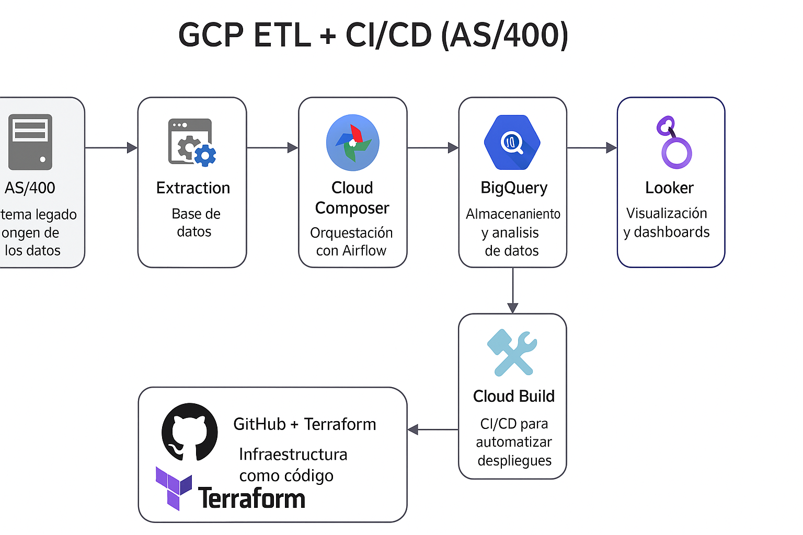
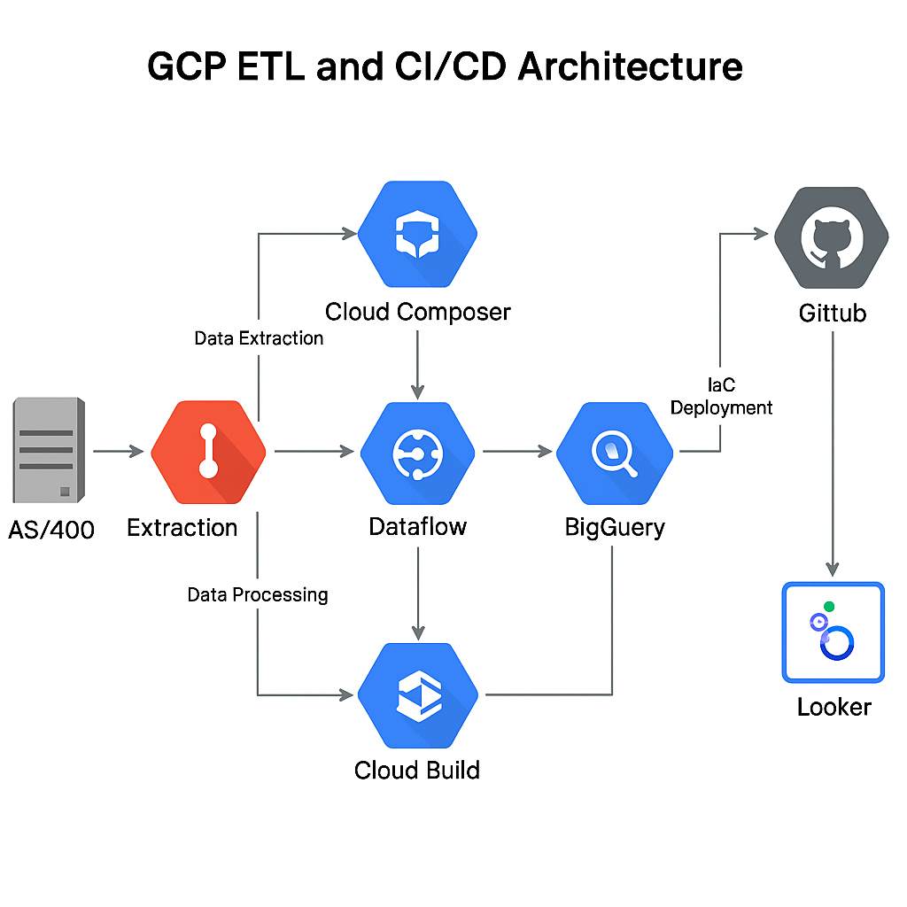

# GCP-ETL-CICD-AS400

Diseño e implementación de una arquitectura moderna, escalable y segura sobre Google Cloud Platform (GCP), orientada a flujos ETL desde AS/400 con principios CI/CD y ambientes segregados: DEV, QA y PRD.

---

## 🌐 Arquitectura General Multientorno

```
AS/400 ➝ Extracción (ODBC/API/FTP)
        ➝ Cloud Storage (/raw/, /staging/)
            ➝ Cloud Composer (DAGs)
                ➝ Dataflow (Batch / Streaming)
                    ➝ BigQuery (datasets separados)
                        ➝ Looker (dashboards BI)
```

---

## 🧱 Componentes por Entorno

| Entorno | Composer     | Bucket Storage       | Dataset BigQuery | Workspace Terraform |
| ------- | ------------ | -------------------- | ---------------- | ------------------- |
| DEV     | composer-dev | gs://etl-dev-bucket | bq_etl_dev     | dev                 |
| QA      | composer-qa  | gs://etl-qa-bucket  | bq_etl_qa      | qa                  |
| PRD     | composer-prd | gs://etl-prd-bucket | bq_etl_prd     | prd                 |

---

## 🔁 Flujo CI/CD por Rama

| Rama Git | Acción Automatizada        | Herramientas            |
| -------- | -------------------------- | ----------------------- |
| `dev`    | Validación DAGs + Dataflow | Cloud Build + Pytest    |
| `qa`     | Despliegue en entorno QA   | Cloud Build + Terraform |
| `main`   | Despliegue en Producción   | Cloud Build + Terraform |

---

## 📦 Estructura del Repositorio

```
├── infra/
│   ├── dev/           # Workspace Terraform DEV
│   ├── qa/            # Workspace Terraform QA
│   └── prd/           # Workspace Terraform PRD
├── dags/              # DAGs por entorno
│   ├── dev/
│   ├── qa/
│   └── prd/
├── dataflow/          # Scripts Apache Beam
│   ├── templates/
│   └── scripts/
├── looker/            # Dashboards y modelos Looker
│   └── dashboards/
├── cloudbuild/        # Pipelines CI/CD
├── docs/              # Imágenes y diagramas de arquitectura
└── README.md
```

---

## ✅ Ventajas del Enfoque GCP Multientorno

| Ventajas                            | Desventajas                                        |
| ----------------------------------- | -------------------------------------------------- |
| Separación robusta entre entornos   | Mayor esfuerzo inicial en infraestructura          |
| CI/CD trazable con rollback         | Gestión avanzada de IAM y seguridad                |
| Auditoría completa por logs         | Costos más altos sin buena gobernanza FinOps       |
| Escalabilidad horizontal automática | Requiere monitoreo continuo y alertas configuradas |

---

## 🖼️ Diagramas de Arquitectura

  


---

## 📌 Recomendaciones

- Usar etiquetas (`labels`) en todos los recursos: `env`, `owner`, `project`, `costcenter`
- Configurar alertas presupuestarias por entorno
- Monitorear Cloud Composer, Dataflow y BigQuery desde Cloud Logging y Cloud Monitoring
- Habilitar versiones y auditoría en buckets (`Object Versioning`)
- Usar variables segregadas por entorno (`terraform.tfvars`) y backend GCS por workspace

---

© Carlos Crudo 2025 - CloudSolutionsIoT®
