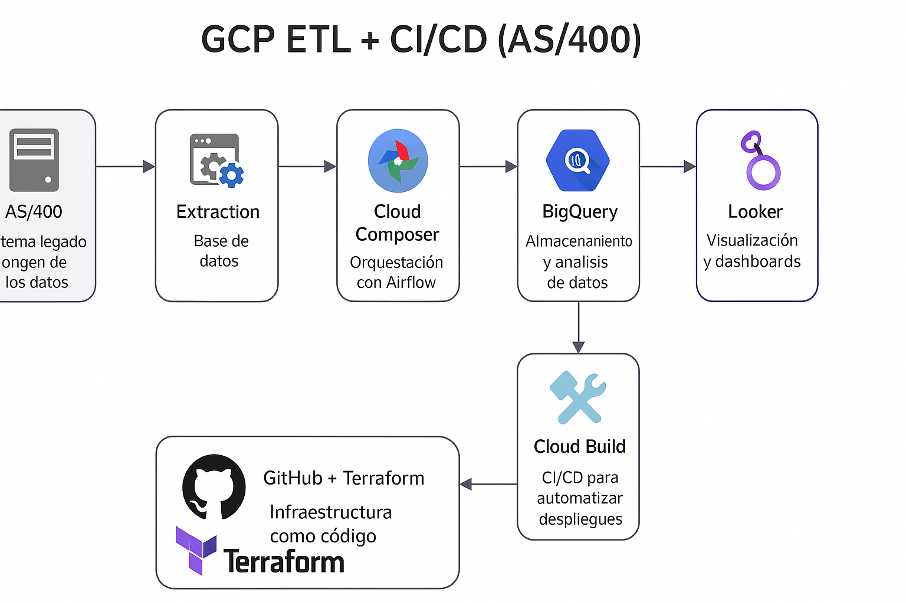
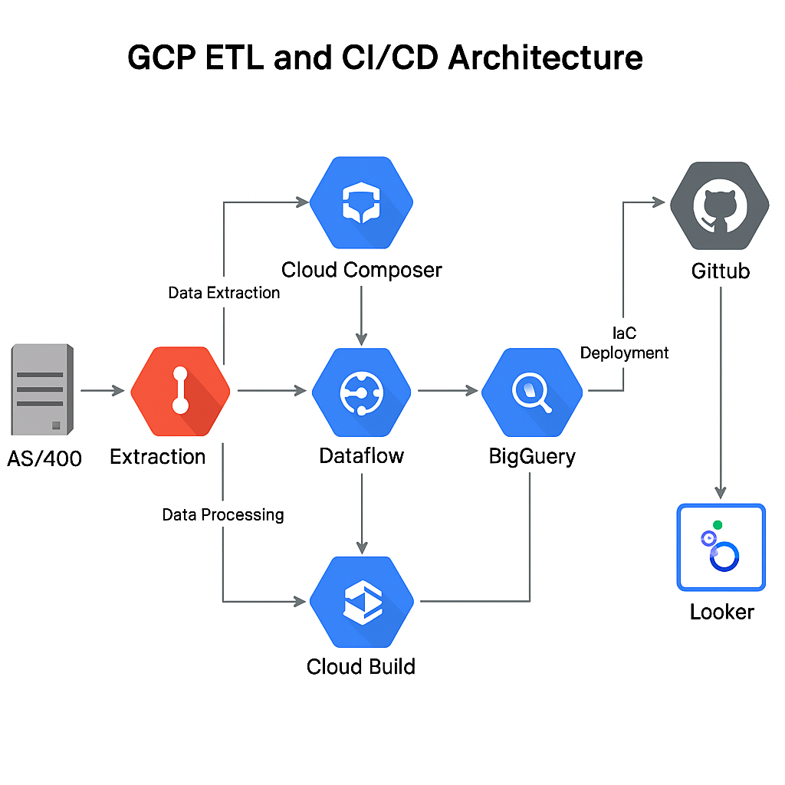

# GCP-ETL-CICD-AS400

Diseno e implementacion de una arquitectura moderna, escalable y segura sobre Google Cloud Platform (GCP), orientada a flujos ETL desde AS/400 con principios CI/CD y ambientes segregados: DEV, QA y PRD.

Este repositorio funciona como blueprint tecnico para modernizacion de datos, gobierno multientorno, trazabilidad operativa y buenas practicas de seguridad en pipelines analiticos.

## Arquitectura general multientorno

```text
AS/400 -> Extraccion (ODBC/API/FTP)
       -> Cloud Storage (/raw/, /staging/)
       -> Cloud Composer (DAGs)
       -> Dataflow (Batch / Streaming)
       -> BigQuery (datasets separados)
       -> Looker (dashboards BI)
```

## Componentes por entorno

| Entorno | Composer | Bucket Storage | Dataset BigQuery | Workspace Terraform |
| --- | --- | --- | --- | --- |
| DEV | composer-dev | gs://etl-dev-bucket | bq_etl_dev | dev |
| QA | composer-qa | gs://etl-qa-bucket | bq_etl_qa | qa |
| PRD | composer-prd | gs://etl-prd-bucket | bq_etl_prd | prd |

## Flujo CI/CD por rama

| Rama Git | Accion automatizada | Herramientas |
| --- | --- | --- |
| `dev` | Validacion DAGs + Dataflow | Cloud Build + Pytest |
| `qa` | Despliegue en entorno QA | Cloud Build + Terraform |
| `main` | Despliegue en Produccion | Cloud Build + Terraform |

## Dominios tecnicos

- Modernizacion ETL desde plataformas legacy AS/400.
- GCP Cloud Storage, Cloud Composer, Dataflow, BigQuery y Looker.
- Infraestructura como codigo con Terraform.
- Separacion DEV/QA/PRD con trazabilidad por rama.
- Seguridad IAM, auditoria, logs y controles de datos.
- FinOps mediante etiquetas, presupuestos y monitoreo.

## Estructura del repositorio

```text
infra/
  dev/           # Workspace Terraform DEV
  qa/            # Workspace Terraform QA
  prd/           # Workspace Terraform PRD
dags/            # DAGs por entorno
dataflow/        # Scripts Apache Beam
looker/          # Dashboards y modelos Looker
cloudbuild/      # Pipelines CI/CD
docs/            # Imagenes y diagramas de arquitectura
```

## Ventajas del enfoque

| Ventajas | Riesgos a gobernar |
| --- | --- |
| Separacion robusta entre entornos | Mayor esfuerzo inicial de infraestructura |
| CI/CD trazable con rollback | Gestion avanzada de IAM y seguridad |
| Auditoria completa por logs | Costos mas altos sin buena gobernanza FinOps |
| Escalabilidad horizontal automatica | Requiere monitoreo continuo y alertas configuradas |

## Diagramas de arquitectura





## Buenas practicas

- Usar etiquetas (`labels`) en todos los recursos: `env`, `owner`, `project`, `costcenter`.
- Configurar alertas presupuestarias por entorno.
- Monitorear Cloud Composer, Dataflow y BigQuery desde Cloud Logging y Cloud Monitoring.
- Habilitar versionado y auditoria en buckets cuando aplique.
- Usar variables segregadas por entorno y backend remoto para Terraform.
- Mantener secretos fuera del repositorio y usar Secret Manager o equivalente.

## Gobierno del repositorio

- [Security Policy](SECURITY.md)
- [Contributing](CONTRIBUTING.md)
- [Notice](NOTICE.md)

## Autor

Carlos Crudo  
Blog: https://carloscrudo.com/  
LinkedIn: https://www.linkedin.com/in/carloscrudo/
